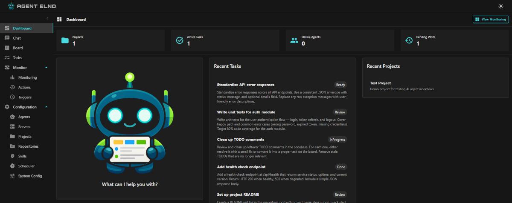
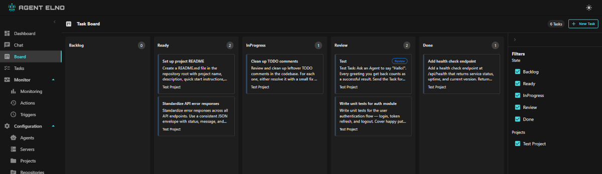

# Agent-Elno — Self-Hosted AI Agent Platform



> A self-hosted AI agent platform that turns a kanban board into an autonomous development team.
> Describe tasks, the operator picks them up, writes code, and delivers results for your review —
> all on your own hardware, with your own models, and zero data leaving your server.
> Free for personal use.

---

## ✨ Features



- **Kanban-driven agents** — create tasks, the operator picks them up and works autonomously
- **Human-in-the-loop** — every result lands in a review column before it's accepted
- **Assistant / brain-dump chat** — describe an idea in plain language, the system creates structured tasks
- **Scheduled triggers** — cron-based agent execution without manual intervention
- **VS Code integration** — MCP server exposes tasks and review directly in your editor
- **Bring your own model** — connect any OpenAI-compatible endpoint (LocalAi, LiteLLM, …) or OpenAI directly
- **100 % self-hosted** — your data never leaves your machine
- **0 % telemetry** — no tracking, no analytics, no data collection ... at least not in our code 😄

---

## 🚀 Quick Start

```bash
curl -fsSL https://raw.githubusercontent.com/data-ps-gmbh/Agent-Elno/main/get-agent-elno.sh | sudo bash
```

The interactive installer asks for your LLM provider, model name, and ports — then starts everything.
Same command to update. Default login: **admin / password**.

→ **[Full installation guide](docs/quickstart.md)**

### Uninstall

```bash
curl -fsSL https://raw.githubusercontent.com/data-ps-gmbh/Agent-Elno/main/remove-agent-elno.sh | sudo bash
```

Removes all services, binaries, config, and data. Asks for confirmation before deleting.

---

## 🔄 How It Works

1. **Open your project in VS Code** — Copilot connects to the agent via MCP
2. **Define tasks with Copilot** — describe what needs to be done, Copilot hands the task into the system
3. **Repeat** — queue up everything that needs doing
4. **The operator works autonomously** — picks up tasks, writes code, creates feature branches
5. **Check out the feature branch** for review — rebase to latest if needed
6. **Review the result** — approve, or add comments requesting changes
7. **Tell the operator to merge** via comment and remove the review tag to let it continue

### Kanban Processing Rules

The operator picks up tasks based on column and tags:

- **Processed:** Any column except *Backlog* and *Done*, without the tags *blocked* or *review*
- **Skipped:** Tasks in *Backlog*, *Done*, or tagged *blocked* / *review*

Move a task to **Ready** (or any active column) to let the operator pick it up.
When the operator finishes, it tags or moves the task to *review* or *done* — you check the result and either approve or comment.

**Away from VS Code?** Use the chat to tell your personal agent things on the go — via the web UI or the mobile app *(currently in closed beta)*.

---

## 🤖 Model Recommendations

We run a hybrid setup: a local Qwen model for orchestration and chat, OpenAI Foundry models for coding and review (bound directly or via [LiteLLM](https://litellm.ai) as a unified proxy).

> **This is our budget setup** — optimized for cost, not peak performance.
> Bigger models (Claude, GPT-4.5, o3) handle larger projects and produce smarter results.
> The table below is a starting point, not a ceiling.

> **The model is everything.**
> Agent-Elno is an orchestration layer — it sets the stage, but the model does the actual thinking.
> A weak model will produce weak results, no matter how well the system is configured.
> A capable model will surprise you. Choose wisely, and the agent becomes genuinely useful;
> choose poorly, and you'll spend more time cleaning up than you saved.

### Current Setup

| Role | Model | Local/Cloud | Why |
|------|-------|-------------|-----|
| **Operator** (task orchestration) | Qwen3-32B-Q4_K_M | Local | Better instruction following than Qwen2.5, reliable function calling, free |
| **Personal Agent** (chat) | Qwen3-32B-Q4_K_M | Local | Great personality, fast responses, keeps data private |
| **Document Editor** | Qwen3-32B-Q4_K_M | Local | Solid markdown and prose generation |
| **Developer** (coding) | gpt-5.1-codex-mini | Cloud (OpenAI) | Great quality-to-cost ratio for large projects |
| **Senior Developer** (complex coding) | gpt-5.1-codex-max | Cloud (OpenAI) | Large context window, handles multi-file changes well |
| **Architect** (design/planning) | o4-mini | Cloud (OpenAI) | Strong reasoning, good at structural decisions |
| **Reviewer** (code review) | o4-mini | Cloud (OpenAI) | Thorough review, follows coding guidelines |
| **Embedding** | nomic-embed-text-v1.5 | Local (LocalAI) | 768-dim, fast, good semantic search quality |

### What We Tried

| Model | Role tested | Verdict | Notes |
|-------|-------------|---------|-------|
| Qwen3-8B | Agent / Operator | ❌ | Bad instruction following |
| Phi-4-Mini-Reasoning | Agent / Operator | ❌ | Hallucinations |
| Phi-4-Mini-Instruct | Agent / Operator | ❌ | Bad function calling |
| Qwen2.5-Coder-32B-Instruct | Coder | ❌ | Poor understanding of large codebases |
| Qwen2.5-Coder-14B-Instruct | Coder | ⚠️ | OK for small projects, not for bigger solutions |
| Qwen3-Coder-30B-A3B | Coder | ❌ | Very fast, very unreliable output |
| Qwen3-Coder-Next | Coder | ❌ | Tends to review instead of code, even with explicit instructions |
| NousResearch Hermes-4-14B | Agent / Operator | ⚠️ | Great personality, OK instruction following, bad as operator |
| Microsoft NextCoder-32B | Coder | ⚠️ | Ignores guidelines, OK for smaller projects only |
| DeepSeek-V3.2 | Coder | ⚠️ | Decent output, problematic function calling behavior |
| GPT-4o | Coder | ⚠️ | Decent, replaced by gpt-4.1 |
| GPT-4.1 | Coder | ✅ | Good context understanding, reliable output — replaced by codex-mini for cost |
| GPT-4.1-Nano | Agent / Operator | ⚠️ | Decent reasoning for a small model |
| Qwen2.5-32B-Instruct | Agent / Operator / Chat | ⚠️ | Good instruction following, great personality — but loops on tool calls under load |
| Qwen3-32B (Q8) | Agent / Operator | ⚠️ | Similar looping issues as Qwen2.5, needs R/W/E guard |

### Recommendations

**For coding tasks:**
- **gpt-5.1-codex-max** (cloud) — very big context for massive coding tasks, redesign or rewrites
- **gpt-5.1-codex-mini** (cloud) — best value: high quality, large context, low cost
- **gpt-4.1** (cloud) — reliable fallback with good context understanding
- Local models struggled with our production codebases (50k–100k lines of C# and 20k–40k lines of Razor per project)

**For orchestration / chat:**
- **Qwen3-32B-Q4_K_M** (local) — our pick: better instruction following than Qwen2.5, great personality, zero cost
- Qwen2.5-32B-Instruct still works but tends to loop on tool calls under load
- Smaller models (8B–14B) were unreliable for function calling

**For review / architecture:**
- **o4-mini** (cloud) — strong reasoning, follows guidelines well

**For embeddings:**
- **nomic-embed-text** — fast, runs locally, good semantic search quality

### Local vs Cloud

- **Local (LocalAI / Ollama):** Free, private, no rate limits — but needs GPU for acceptable speed (32B needs ~24 GB VRAM)
- **Cloud (OpenAI / Azure):** Faster, smarter coding models — but costs money and data leaves your server
- **Hybrid (LiteLLM):** Route orchestration locally, coding to cloud — best of both worlds

---
## 📖 Documentation

| | |
|---|---|
| **[Quick Start](docs/quickstart.md)** | Installation and first steps |
| **[Configuration](docs/configuration.md)** | Environment files, config modes, all options |
| **[Architecture](docs/architecture.md)** | Service architecture and data flow |
| **[Operator Process](docs/operator-process.md)** | How the autonomous loop works |
| **[Agents & Skills](docs/agents-and-skills.md)** | Agent definitions and prompt templates |
| **[Chat & Memory](docs/personal-agent-chat.md)** | Personal agent, sessions, semantic memory |
| **[Scheduler](docs/scheduler.md)** | Cron-based triggers |
| **[Integrations](docs/integrations.md)** | LiteLLM, Ollama, OpenAI, nginx, Traefik |
| **[Troubleshooting](docs/troubleshooting.md)** | Logs, action log, common issues |
| **[Changelog](docs/changelog.md)** | Release history |

---

## 📋 Requirements

- **Debian 12+** or **Ubuntu 22.04+** (x64)
- An **OpenAI-compatible LLM endpoint** (Ollama, LiteLLM, OpenAI, …)
- 2 GB RAM, 4 GB disk minimum

No Docker, no .NET SDK, no runtime installation required.

---

## 💬 Support & Feedback

We built Agent-Elno to fit our own workflow — but we're actively developing it further.
If you have suggestions, feature requests, or run into problems, we'd love to hear from you.

- **Feature ideas** — open an issue; if it fits our roadmap, we'll try to integrate it
- **Bug reports** — please include a brief description of the problem and steps to reproduce; we'll investigate anything we can reproduce ourselves
- **Questions** — we try to answer as fast as we can

We can't promise everything, but we read every issue and do our best to help.

- [GitHub Issues](https://github.com/data-ps-gmbh/Agent-Elno/issues) — bug reports, feature requests, questions
- [data-ps.de](https://www.data-ps.de) — company website
- [info@data-ps.de](mailto:info@data-ps.de) — commercial inquiries

---

## 📜 License

**Free for personal, non-commercial use** under the
[PolyForm Strict License 1.0.0](license.txt).

**Commercial use requires a separate license** — contact [info@data-ps.de](mailto:info@data-ps.de).

© 2014–2026 DATA-PS GmbH. All rights reserved.

